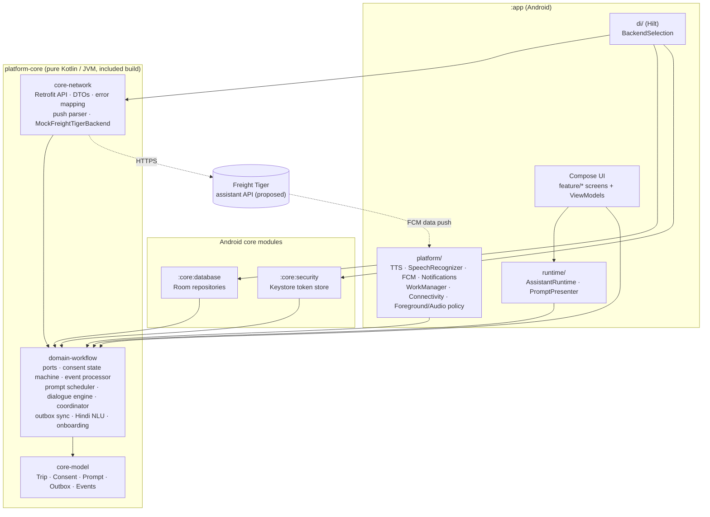
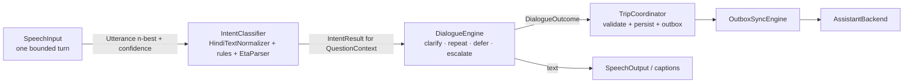
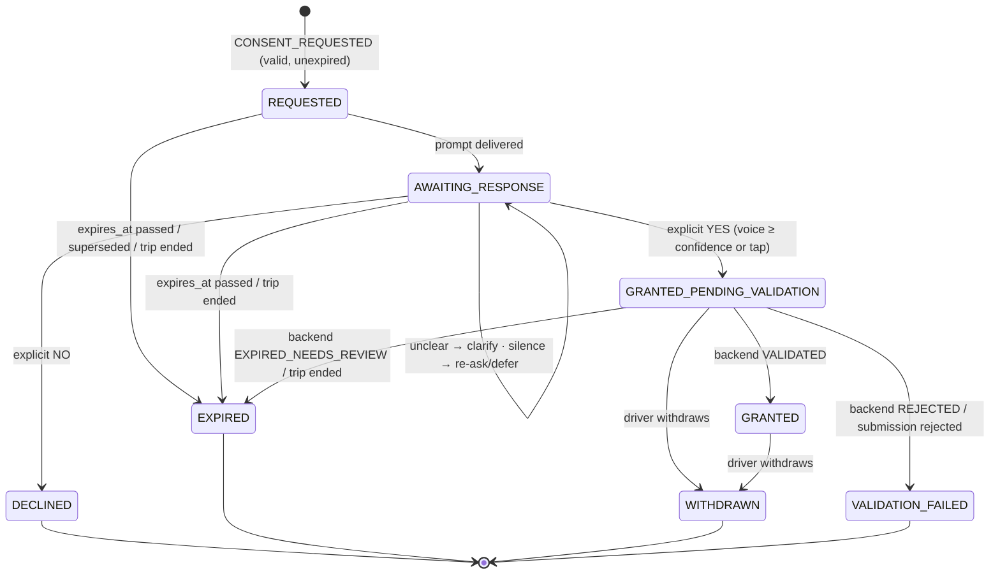
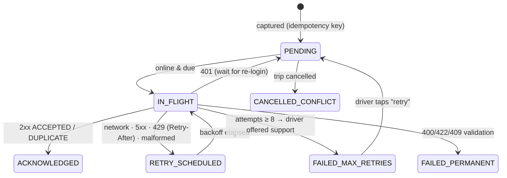

# Architecture

## Goals that shaped the design

1. **Safety and consent are business rules, not UI details.** They live in pure Kotlin (`platform-core`),
   independent of Android, and are covered by fast JVM tests.
2. **Every integration is replaceable.** Speech input, speech output, intent classification, conversation
   management, the trip workflow, persistence and the backend are separate interfaces (ports).
3. **The backend is authoritative.** The app records what the driver said and when. It never decides on
   its own that consent is valid or that tracking is active.
4. **Offline first.** Everything the driver says is persisted and delivered through a durable,
   idempotent outbox.

## Module diagram



Dependency rule: arrows point inwards. `domain-workflow` depends only on `core-model` and coroutines. It
defines **ports**, and the outer layers implement them:

| Port (domain) | Production implementation | Test / demo implementation |
|---|---|---|
| `AssistantBackend`, `AuthGateway` | `RemoteAssistantBackend`, `RemoteAuthGateway` (core-network) | `MockFreightTigerBackend` (demo), `FakeBackend` (tests), `UnconfiguredBackend` |
| `SpeechOutput` | `AndroidTextToSpeechOutput` | `FakeSpeechOutput` (androidTest) |
| `SpeechInput` | `AndroidSpeechRecognizerInput` | `FakeSpeechInput` (androidTest) |
| `IntentClassifier` | `RuleBasedIntentClassifier` | future AI/LLM classifier |
| `PromptCatalog` | `HindiPromptCatalog` | more languages later |
| `TripRepository`, `ConsentRepository`, `OutboxRepository`, `PromptRepository`, `InboundEventRepository`, `ActivityLog`, `SessionRepository` | Room (`:core:database`) | in-memory (`domain/inmemory`) |
| `AccessTokenStore` | `KeystoreTokenStore` (`:core:security`) | in-memory |
| `ConnectivityMonitor` | `AndroidConnectivityMonitor` (+ demo offline switch) | `ManualConnectivityMonitor` |
| `SyncTrigger` | `SyncScheduler` (in-process + WorkManager) | counter in tests |

## Voice pipeline: separated components



* **HindiTextNormalizer** maps Devanagari and romanised/Hinglish variants to canonical tokens ("नहीं",
  "nahin", "nhi" → `nahi`; "gayi"/"gaye" → `gaya`). It collapses spelling only. Negations, numbers and
  qualifiers are always kept.
* **RuleBasedIntentClassifier** is context-aware. Consent intents are produced only for a consent question,
  only from explicit words, and only from the recogniser's top alternative. Weak agreement ("ठीक है", "ok"),
  hedges ("शायद", "पता नहीं"), deferrals ("अभी नहीं", "बाद में") and mixed yes/no are `UNKNOWN`. "Repeat" and
  "support" are recognised in every context, and "samajh nahi aaya" is a repeat request, not a "no".
* **EtaParser** handles "एक घंटा", "do ghante", "aadha/dedh/dhai ghanta", "sava/paune/saadhe", minutes,
  digits and ranges ("do teen ghante" → upper bound, flagged approximate). Vague answers ("thodi der") are
  not guessed; the engine asks again.
* **DialogueEngine** is pure: it returns `Ask`, `Complete`, `Defer`, `Escalate` or `FallbackToTap` steps.
  Silence and no-match are re-asked once and then deferred. They never count as an answer. After 2
  clarifications it escalates to tap buttons plus support.
* **VoiceViewModel** (app) executes the steps: speaks with TTS, shows captions, and opens **one** listening
  turn only after an explicit driver action ("Talk", "Answer now", mic button). Prompts the app presents
  on its own are spoken, but the mic stays off until the driver taps.

## Inbound trip events

```mermaid
sequenceDiagram
  participant FT as Freight Tiger (FCM / poll / demo channel)
  participant RT as AssistantRuntime
  participant P as TripEventProcessor
  participant S as PromptScheduler
  participant PR as PromptPresenter
  FT->>RT: InboundTripEvent
  RT->>P: process(event)
  P->>P: 1 validate (ids, schema major=1, payload type)
  P->>P: 2 dedupe by event_id (persisted)
  P->>P: 3 relevance: driver matches session, trip known/active
  P->>P: 4 validity: expires_at, trip not cancelled/completed
  P->>S: 5 schedule prompt (dedupe key, cooldown, expiry)
  S-->>P: Scheduled / Suppressed
  P-->>RT: Applied(prompt) / Duplicate / Rejected / Ignored
  RT->>PR: present(prompt)
  alt app visible, auto-speak on, not in a call
    PR->>PR: open voice screen (speak; mic needs tap)
  else
    PR->>PR: actionable notification (Answer now / Later)
  end
```

Supported events: `TRIP_ASSIGNED` (spoken briefing), `CONSENT_REQUESTED`, `TRACKING_STATUS_UPDATED`,
`MILESTONE_UPDATE_REQUESTED` (ETA / arrival / loading status), `TRIP_CANCELLED`, `TRIP_COMPLETED`.

Conflict rules include:
- activation for a cancelled or completed trip is refused;
- activation without a backend-validated consent for **that** trip is refused and logged as a conflict;
- a newer consent request supersedes unanswered older ones;
- cancelling a trip expires its pending consents, cancels its prompts, and moves queued updates to
  `CANCELLED_CONFLICT` (support requests are still sent).

## Consent state machine



`NOT_REQUESTED` is the implicit state before any request exists. Separately, each response tracks
**submission**: `CAPTURED_LOCALLY → SUBMITTED → ACCEPTED` (or `REJECTED`), with the **original capture
time** preserved. Tracking status (`NOT_STARTED / PENDING_ACTIVATION / ACTIVE / FAILED / STOP_REQUESTED /
STOPPED`) is a separate field that only backend events or state snapshots change.

Invariants (enforced in `ConsentStateMachine` and covered by tests):
- only an explicit decision event can lead towards `GRANTED`, and only a backend verdict reaches it;
- `DECLINED`, `WITHDRAWN`, `EXPIRED` and `VALIDATION_FAILED` can never become `GRANTED`;
- answers after `expires_at` are refused, and a new request (new id) is required;
- consent records are per trip and per request id, never reused across trips or purposes.

## Outbox and synchronisation



- Backoff: 5 s × 2ⁿ, capped at 15 min, ±20 % jitter, 8 attempts.
- `IN_FLIGHT` rows left behind by a killed process are resent with the same idempotency key.
- Delivery runs in-process immediately, and through WorkManager with a network constraint for durability
  and scheduled retries. Connectivity regained triggers a sync.
- `ACKNOWLEDGED` is the only state that means "delivered". Queued is shown as "being sent".

## Android execution constraints honoured

- **No background microphone.** `SpeechRecognizer` runs only for single bounded turns (15 s max) from the
  visible voice screen after an explicit tap. There is no foreground service and no always-listening mode.
- **No speech from a push in the background.** A push produces an actionable notification. Speaking
  happens only when the app is visible, auto-speak is enabled, and the phone is not in a call or ringing
  (`AudioPolicy`).
- TTS uses transient, ducking audio focus (`USAGE_ASSISTANT`). "Stop audio" is always available.
- Permissions are requested just in time (microphone at the mic tap or during onboarding, notifications
  during onboarding). Denial degrades to tap answers and in-app pending cards.
- WorkManager is initialised on demand with the Hilt worker factory. Deferred prompts resurface through a
  `PromptReminderWorker`.

## Persistence

Room tables: `trips`, `consents`, `inbound_events` (dedupe + history), `outbox` (unique
`idempotencyKey`), `prompts`, `activity`, `session`. Domain objects are stored as JSON next to the indexed
columns used for queries. Backups and device transfer are disabled for all app data.
